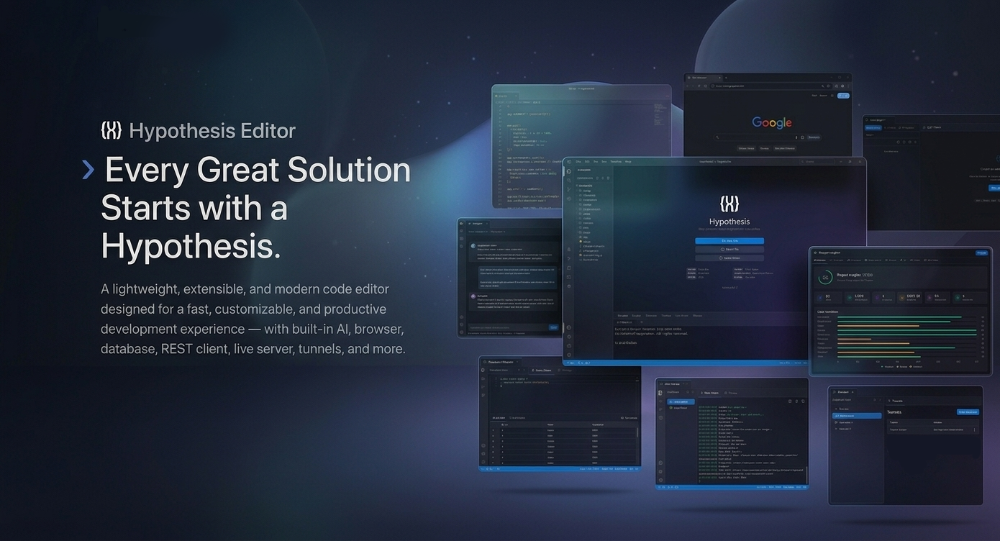

# Hypothesis Editor

> Every Great Solution Starts with a Hypothesis.

A lightweight, extensible, and modern code editor designed for a fast, customizable, and productive development experience — with built-in AI, browser, database, REST client, live server, tunnels, and more.

  

## 📦 Download

Get the latest release for your platform from [**GitHub Releases**](https://github.com/Hypothesis-Studio/Hypothesis-Editor/releases).

| Platform | Format |
|----------|--------|
| Windows  | `.exe` (installer), `.exe` (portable) |
| macOS    | `.dmg`, `.zip` |
| Linux    | `.AppImage`, `.deb`, `.rpm` |

---

## ✨ Features

### 🖊️ Editor
- Syntax highlighting for 50+ languages
- Multi-tab editing with dirty state indicators
- Auto-save, trim whitespace, insert final newline, format on save
- Font picker with multiple coding fonts
- 4 built-in themes: Hypothesis Dark, Hypothesis Light, VS Dark, High Contrast
- Side-by-side diff viewer (right-click tab → Compare With...)
- Resizable split preview panel
- File preview: HTML, Markdown, SVG, images, audio, video, PDF

### 🤖 AI Agent
- Autonomous AI assistant with tool execution
- Reads, writes, and edits files; runs terminal commands; queries git
- Supports multiple AI providers with custom gateway support
- Streaming chat with collapsible code blocks
- Right-click selected code → "Ask AI Agent" / "Fix With AI Agent"
- Memory system and session persistence across restarts
- Open with `Ctrl+Shift+A`

### 🌐 Web Browser
- Full embedded browser with multi-tab support
- Address bar with HTTPS indicator and search suggestions
- Bookmarks with folders, browsing history, downloads with progress
- Find in page, zoom, DevTools toggle
- New Tab page with clock, search, quick links, recent visits
- Open with `Ctrl+Shift+B`

### 🌍 Live Server
- Serve any local folder as a live website instantly
- Auto-reload page when files change — no manual refresh needed
- CSS-only changes hot-swap stylesheets without full reload
- SPA mode — serves `index.html` for all unknown routes
- HTTP and HTTPS support
- CORS enabled by default
- Per-request log: method, path, status, bytes, duration
- File change log: shows every file added, modified, or deleted
- Auto port-finding if requested port is busy
- Copy URL, open in internal browser, open folder per server
- Run multiple servers simultaneously
- Accessible via Panel → Live Server tab

### 🔌 Tunnels
- Forward any local port to a public URL instantly
- Run multiple tunnels simultaneously
- Auto-reconnect on disconnect
- Custom subdomain and label per tunnel
- Per-tunnel HTTP request activity log
- Copy URL to clipboard, open in browser
- Accessible via Panel → Tunnels tab

### 🗄️ Database Explorer
- Connect to SQLite, PostgreSQL, and MySQL/MariaDB databases
- Browse schema: tables, views, columns, indexes, foreign keys
- Table data viewer with pagination
- Multi-tab query editor with keyboard shortcut to run
- Query history grouped by day
- Open with `Ctrl+Shift+D`

### 🔧 REST Client
- Full API testing client — collections, folders, request history
- Request builder: params, headers, body, authentication, scripts
- Auth: Bearer, Basic, API Key, OAuth2, Digest, AWS SigV4
- Pre-request and test scripts
- Response viewer: body, headers, cookies, timeline, tests, TLS info
- Environments with variable interpolation
- Collection runner with assertion results
- Import from Postman, OpenAPI, Insomnia, cURL, HAR
- Export to multiple formats
- Open with `Ctrl+Shift+R`

### 📊 Project Insights
- Full project analysis dashboard
- File statistics, language breakdown, code complexity
- Dependency check, security scan, git health, duplicate detection
- Health score with recommendations
- Open via ActivityBar dashboard icon

### 🔍 Search & Replace
- Full-text search across all workspace files
- Replace and Replace All with live preview

### 📁 File Explorer
- Multi-root workspace support
- Create, rename, delete, copy, move files and folders
- Drag-and-drop support

### 🔀 Git
- Full git workflow: stage, unstage, commit, push, pull, fetch
- Branch management: create, checkout, merge
- Stash, discard changes, diff viewer, commit log

### 💻 Terminal
- Integrated terminal with multiple instances
- Run files directly with output captured to Output/Console/Problems panels
- Auto-detects errors from output

### 🔌 Extensions
- Install extensions from `.hyp` files
- Enable, disable, uninstall from the Extensions sidebar
- Support for custom icon themes

### ⌨️ Command Palette
- `Ctrl+Shift+P` — access all commands instantly
- and more..
---

## 🔌 Extensions

Hypothesis supports a lightweight extension system. Extensions are `.hyp` files installable from the Extensions sidebar.

Browse community extensions at the [**Hypothesis Extension**](https://github.com/Hypothesis-Studio/Hypothesis-Extension) repository.

Build your own using the [Extension Boilerplate](https://github.com/Hypothesis-Studio/Hypothesis-Extension/tree/main/Extention-Boilerplate).

---

## 📄 License

[MIT](LICENSE) © 2026 Hypothesis Studio

  Made with ❤️ by <a href="https://github.com/Hypothesis-Studio">Hypothesis Studio</a>

