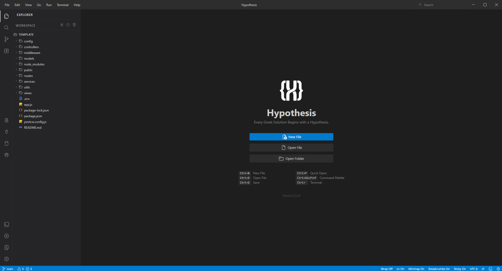

# Hypothesis Editor

> Every Great Solution Starts with a Hypothesis Editor..

A lightweight, extensible, and modern code editor designed to provide a fast, customizable, and productive development experience.

  

## 📦 Installation

Download the latest installer for your platform from [**GitHub Releases**](https://github.com/Hypothesis-Studio/Hypothesis-Editor/releases).

| Platform | Format |
|----------|--------|
| Windows  | `.exe` (installer), `.exe` (portable) |
| macOS    | `.dmg`, `.zip` |
| Linux    | `.AppImage`, `.deb`, `.rpm` |

## 🚀 Getting Started

1. Download and install Hypothesis Editor from the releases.
2. Open a folder via **File → Open Folder**.
3. Start editing.

## 🔌 Extensions

Hypothesis supports a lightweight extension system. Extensions are packaged as `.hyp` files and can be installed from the **Extensions** sidebar.

Browse available extensions at the [**Hypothesis Extension**](https://github.com/Hypothesis-Studio/Hypothesis-Extension) repository.

Want to build your own? Check out the [Extension Boilerplate](https://github.com/Hypothesis-Studio/Hypothesis-Extension/tree/main/Extention-Boilerplate).

## 📄 License

[MIT](LICENSE) © 2026 Hypothesis Studio

  Made with ❤️ by <a href="https://github.com/Hypothesis-Studio">Hypothesis Studio</a>

